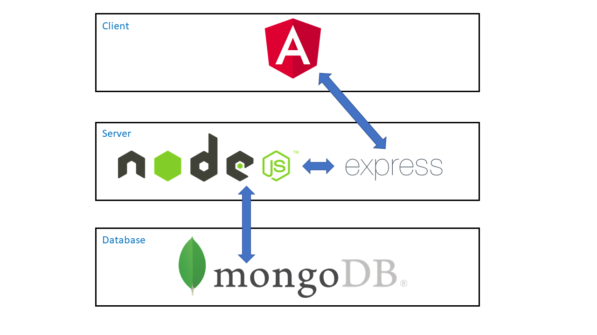
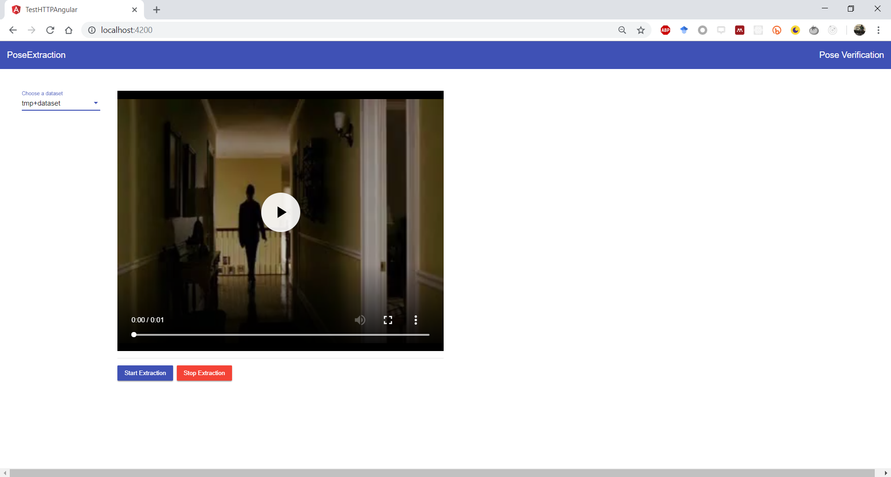
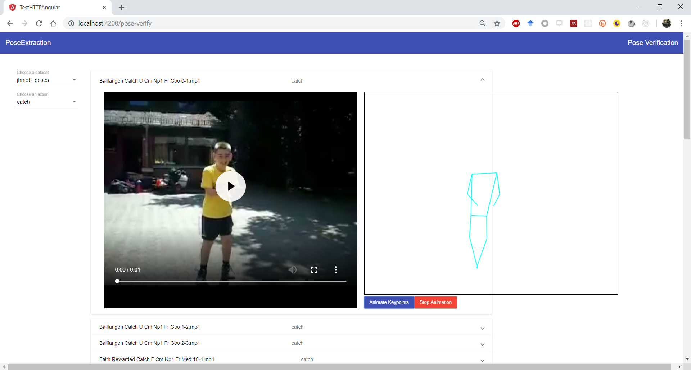
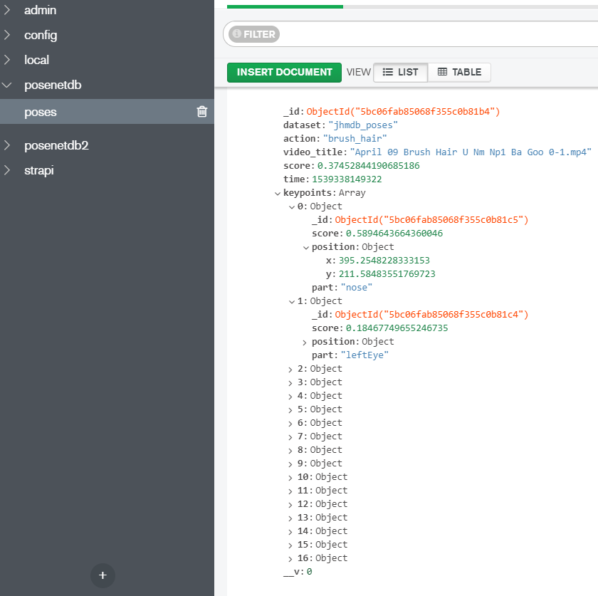
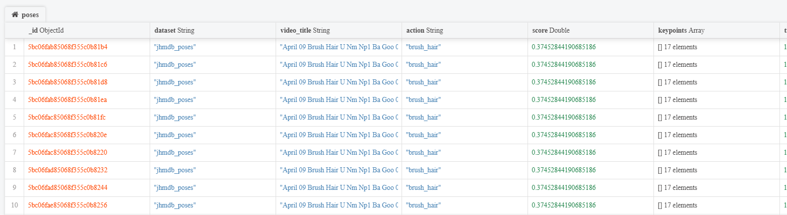

<<<<<<< HEAD
=======
# PoseNetAngular 

>>>>>>> 3ec4f179ed0323659c72c42eeb67b3b67783811f
This project was generated with [Angular CLI](https://github.com/angular/angular-cli) version 6.2.1.

# PoseNetAngular

This project aims at utilizing the PoseNet library (https://github.com/tensorflow/tfjs-models/tree/master/posenet) released as subproject from tfjs team and extract poses from other action recognition datasets. Once deployed with the help of a browser ideally chrome, use is capable of extracting poses from any video dataset stored in the backend server as and when needed. 

In its current form user has to manually choose a dataset which is he/she is interested and initiate the pose extraction.

Once the poses are extracted the same can be verified on a per video basis by reaching the pose verification page and selecting the desired video clip and animating the key frames.

The architecture of this project is basically a MEAN stack based approach as shown below.

## Servers

### Development server

Run `ng serve` for a dev server. Navigate to `http://localhost:4200/`. The app will automatically reload if you change any of the source files. This is done primarily to enable hot replacement of changes and quciker deployment of angular changes.

### Backend Server
Run `npm run backend` to start the ExpressJS server which also handles the connection to the MongoDB. To change the mondgoDB connection setting please look into **backend/app.js** file.

### MongoDB setup

Please refer the mongoDB installation guidelines for your specific OS and install accordingly. The connection settings for Atlas MongoDB is different and should be handled differently. A sample code snippet is available in the **backend/app.js** file. The current code only gurantees handling MongoDB running locally on you device eventhough the code is tested against Atlas MongoDB. DB creation and table modeling is automatically handled by the mongoose library.

## Sample Screen shots
A simple screen shot is provided below for the reference. The screens should appear as shown below for the follwing sections.

### Pose Extraction

### Pose Verification

### New dataset handling
It is important to note that the videos are served from the backend server using expresJS and videos are played as streams using VideoAugular component https://github.com/videogular/videogular2. 

Assume you have new daataset called action_2018 with different actions namely jump, crawl, brush. Then you should segregate your videos into separate folders based on their actions and place them in a folder called action_2018. THen place this folder inside **backen/assets/videos** folder. A sample for JHMDB dataset is show below.

## MongoDB table structuring

In MongoDB the extracted poses are saved in the following format. Every single video being played will generate certain number of series of poses and are stored the db called posedb under the table poses in the structure shown below.

Once a video is played and poses are extracted the same is stored as multiple document entries withing mongoDB as shown below.

## Code scaffolding

Run `ng generate component component-name` to generate a new component. You can also use `ng generate directive|pipe|service|class|guard|interface|enum|module`.

## Build

Run `ng build` to build the project. The build artifacts will be stored in the `dist/` directory. Use the `--prod` flag for a production build.

## Running unit tests

Run `ng test` to execute the unit tests via [Karma](https://karma-runner.github.io).

## Running end-to-end tests

Run `ng e2e` to execute the end-to-end tests via [Protractor](http://www.protractortest.org/).

## Further help

To get more help on the Angular CLI use `ng help` or go check out the [Angular CLI README](https://github.com/angular/angular-cli/blob/master/README.md).
